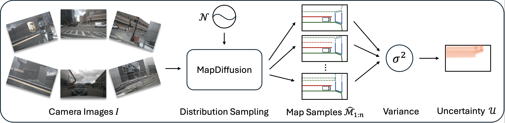

<div align="center">
<h1>MapDiffusion</h1>

<h3>Generative Diffusion for Vectorized Online HD Map Construction and Uncertainty Estimation in Autonomous Driving</h3>

  [](https://arxiv.org/abs/2507.21423)


 

</div>

## Introduction

This repository is the official implementation of MapDiffusion, a novel generative approach that leverages the diffusion paradigm to learn the full distribution of possible vectorized maps for online HD map construction. Instead of predicting a single deterministic output, MapDiffusion iteratively refines randomly initialized queries, conditioned on a Bird's-Eye View (BEV) latent grid, to generate multiple plausible map samples. This allows for improved prediction accuracy and the derivation of uncertainty estimates that directly correlate with scene ambiguity.

MapDiffusion builds upon the architecture of StreamMapNet, embedding the decoder into a generative diffusion process.

## Code

The code will be released soon. Stay tuned!

## Getting Started

### 1. Environment

**Step 1.** Build the Docker image.

```bash
docker build -t mapdiffusion:v1.0 -f $(pwd)/Dockerfile .
```

**Step 2.** Run the container.

```bash
docker run --gpus all --ipc=host -it --rm \
    -v $(pwd):/mapdiffusion \
    mapdiffusion:v1.0
```

This will launch a container with GPU support (if available) and mount the current working directory into `/mapdiffusion` inside the container.

#### Core Dependencies

The project has been tested with the following core versions:

- Python: 3.11.13
- CUDA: 12.4 (container base) / builds compatible with cu118 wheels
- PyTorch: 2.0.1+cu118
- TorchVision: 0.15.2+cu118
- TorchAudio: 2.0.2+cu118
- MMCV: 2.0.0rc4
- MMEngine: 0.10.7
- MMDetection: 3.0.0
- MMDetection3D: 1.4.0
- NumPy: 1.26.4qq

### 2. Data Preparation

**Step 1.** Download the NuScenes dataset to `./datasets/nuScenes`.

**Step 2.** Generate annotation files for the NuScenes dataset using the newsplit from StreamMapNet.

```bash
python tools/nuscenes_converter.py --data-root ./datasets/nuScenes --newsplit
```

### 3. Training and Validating

To train a model with 8 GPUs:

```bash
bash tools/dist_train.sh ${CONFIG} 8
```

To validate a model with 8 GPUs:

```bash
bash tools/dist_test.sh ${CONFIG} ${CHECKPOINT} 8 --eval
```

To test a model's inference speed:

```bash
python tools/benchmark.py ${CONFIG} ${CHECKPOINT}
```

## Results

### Results on NuScenes split with no geospatial overlap

The performance is evaluated at a perception range of $60\ m \times 30\ m$ on the nuScenes split without geospatial overlap, as defined in StreamMapNet.

| Method | $\mathrm{AP}_{ped}$ | $\mathrm{AP}_{div}$ | $\mathrm{AP}_{bound}$ | $\mathrm{mAP}$ |
|---------|---------------------|---------------------|-----------------------|----------------|
| VectorMapNet | 15.8 | 17.0 | 21.2 | 18.0 |
| MapTR | 7.5 | 23.0 | 35.8 | 22.1 |
| MapVR | 10.1 | 22.6 | 35.7 | 22.8 |
| MGMap | 7.9 | 25.6 | 37.4 | 23.7 |
| MapTRv2 | 16.2 | 28.7 | 44.8 | 29.9 |
| SQD-MapNet | 31.6 | 27.4 | 40.4 | 33.1 |
| StreamMapNet | 31.2 | 27.3 | 42.9 | 33.8 |
| **MapDiffusion (ours)** | **32.9** | **31.4** | **42.4** | **35.6** |

## Citation

If you find our paper or codebase useful in your research, please give us a star and cite our paper.

```bibtex
@article{Monninger2025MapDiffusion,
  title   = {MapDiffusion: Generative Diffusion for Vectorized Online HD Map Construction and Uncertainty Estimation in Autonomous Driving},
  author  = {Monninger, Thomas and Zhang, Zihan and Mo, Zhipeng and Anwar, Md Zafar and Staab, Steffen and Ding, Sihao},
  journal = {arXiv preprint arXiv:2507.21423},
  year    = {2025}
}
```
